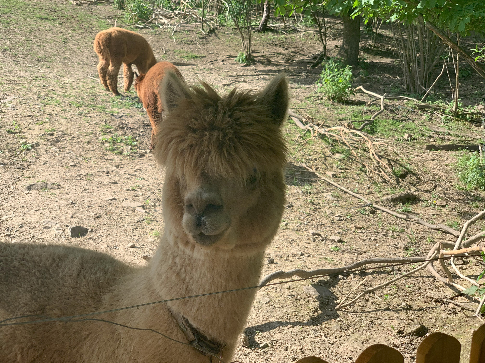

# (Pre-Trained) Models

## ResNet18/34/50/101/152 (Image Classification)

In the following table, the provided pre-trained ResNets are presented based on their key data (requires at least GradValley.jl v0.1.0). 

| Model    | Parameters | Pre-Trained on ImageNet | Accuracy on ImageNet-1K: Top-1/Top-5 | Categories | File size    | Download                                                                  |
|----------|------------|-------------------------|--------------------------------------|-------------|--------------|---------------------------------------------------------------------------|
| ResNet18 | 11,689,512 | ✓                       | ~70%/~89%                            | 1000        | 89 MB        |   [Here](https://www.jst-projekte.de/downloads/resnets/ResNet18.zip)   |
| ResNet34 | 21,797,672 | ✓                       | ~73%/~91%                            | 1000        | 166 MB        |   [Here](https://www.jst-projekte.de/downloads/resnets/ResNet34.zip)   |
| ResNet50 | 25,557,032 | ✓                       | ~81%/~95%                            | 1000        | 195 MB        |   [Here](https://www.jst-projekte.de/downloads/resnets/ResNet50.zip)   |
| ResNet101 | 44,549,160 | ✓                       | ~82%/~96%                            | 1000        | 340 MB        |   [Here](https://www.jst-projekte.de/downloads/resnets/ResNet101.zip)   |
| ResNet152 | 60,192,808 | ✓                       | ~82%/~96%                            | 1000        | 460 MB        |   [Here](https://www.jst-projekte.de/downloads/resnets/ResNet152.zip)   |

*Currently, the files are hosted on my website. If you know a better place to host files which are too big for GitHub but are part of an open source julia package, please [let me know](https://github.com/jonas208/GradValley.jl/discussions/categories/ideas).*

The downloaded folders each contain seven files:
```
ResNetXX/
├── ResNet.jl
├── ResNetXX_pre-trained.jld2
├── categories_array.jld2
├── preprocessing_for_resnets.jl
├── load_ResNet_and_make_predictions.jl
├── example_image1.jpg
├── example_image2.jpg
```
Where XX stands for the "ResNet ID" (18/34/50/101/152). For using this files, the follwing packages must be installed: [GradValley.jl](https://github.com/jonas208/GradValley.jl), [FileIO.jl](https://github.com/JuliaIO/FileIO.jl), [Images.jl](https://github.com/JuliaImages/Images.jl) and [ImageTransformations.jl](https://github.com/JuliaImages/ImageTransformations.jl).
The last two packages are used by `preprocessing_for_resnets.jl`.

- `ResNet.jl`: The [source script](https://github.com/jonas208/GradValley.jl/blob/main/examples/ResNet.jl) of the model definition, required for loading the `ResNetXX_pre-trained.jld2` file.
- `ResNetXX_pre-trained.jld2`: The pre-trained ResNet in form of a .jld2 file.
- `categories_array.jld2`: A vector containing the 1000 category names of ImageNet in the form of a .jld2 file.
- `preprocessing_for_resnets.jl`: A script with useful functions for loading and pre-processing images before they can be classified by the ResNets. 
- `load_ResNet_and_make_predictions.jl`: A short script showing how to load the model and use it to make predictions.
- `example_image1.jpg`, `example_image2.jpg`: The example images used by `load_ResNets_make_prediction.jl`. The images don't come from the Image Net dataset or similar, instead, the two images are from my personal photo gallery on my phone.

For example, the `load_ResNet_and_make_predictions.jl` script for ResNet18 looks like this (all scripts look exactly the same except the ResNet "ID" in the `model = load("ResNetXX_pre-trained.jld2", "model")` line and the function which is called for pre-processing, in this case `preprocess_for_resnet18_and_34()`.): 
```julia
include("ResNet.jl") # required for loading the ResNetXX_pre-trained.jld2 file
include("preprocessing_for_resnets.jl") # takes care of all the pre-processing of the images before they can be fed into the model
using FileIO # front-end package for loading e.g. JLD2 files 
using CUDA

model = load("ResNet18_pre-trained.jld2", "model") # loads the pre-trained ResNet into the variable model (model is a SequentialContainer)
testmode!(model) # because we just want to make predictions, we switch the mode to testing/evaluation mode
categories = load("categories_array.jld2", "categories_array") # categories is a vector containing all the 1000 classes of ImageNet-1k

# define the element type you want to use
dtype = Float32 # Float32 or Float64 (Float32 is usually faster, especially on the GPU!)
use_cuda = CUDA.functional() # check if a CUDA capable GPU is available
# move the loaded model to the correct element type and device
if use_cuda
    println("The GPU is used")
    module_to_eltype_device!(model, element_type=dtype, device="gpu")
else
    println("The CPU is used")
    module_to_eltype_device!(model, element_type=dtype, device="cpu")
end

# a function taking a path to an image file, returns the name of the predicted class and the score in percent
function make_prediciton(path::AbstractString)
    image = read_image_from_file(path) # reads the image into an UInt8 3d-array of size (width, height, channels) where channels must be 3
    image = preprocess_for_resnet18_and_34(image, dtype=dtype) # pre-processing when using ResNet18/34
    # image = preprocess_for_resnet50_and_101_and_152(image, dtype=dtype) # pre-processing when using ResNet50/101/152
    image = add_batch_dim(image) # add a batch dimension is required before the image can be fed into the model, image is now a 4d-array of size (width, height, channels, 1) where channels must be 3
    
    # if CUDA is available, move the image array to the GPU
    if use_cuda
        image = CuArray(image)
    end
    
    prediction = GradValley.Functional.softmax_forward(model(image), dims=1)[:, 1] # make the prediction (note that the first run can take a while because a lot of code has to get compiled at the first run)
    # prediction = model(image)[:, 1] # try without softmax if you get NaN values using softmax (if the images have been prepared well by the pre-processing, this should not happen)

    prediction = Array(prediction) # if a GPU is used, move the GPU array back to the CPU memory

    class_index = argmax(prediction)
    score = prediction[class_index] * 100
    class = categories[class_index]

    return class, score
end

for testimage in ["example_image1.jpg", "example_image2.jpg"] # add more images here if you want 
    class, score = make_prediciton(testimage)
    println("""Image: $testimage: Predicted class: "$(class)" with score of $(round(score, digits=1))%""")
end
```
It is heavily recommended to run this file, and any other files using GradValley, with multiple threads. Using multiple threads can make calculating predictions and training much faster.
To do this, use the `-t` option when running a julia script in terminal/PowerShell/command line/etc.
If your CPU has 24 threads, for example, then run:
`julia -t 24 ./load_ResNet_and_make_predictions.jl`
The specified number of threads should match the number of threads your CPU provides. When you run the script, you will get:
```
Image: example_image1.jpg: Predicted class: "castle" with score of 99.2%
Image: example_image2.jpg: Predicted class: "llama" with score of 81.6%
```
**We can see that both predicted classes are correct!**

**example_image1.jpg**

**example_image2.jpg**


What's next? Maybe try changing the script to print out the top 5 categories and not just the top 1.